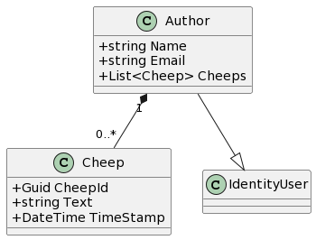

# Design and Architecture of _Chirp!_

## Domain model

Our domain model is built around the core concept of an Author, which is central to the _Chirp!_ application's functionality. An Author represents a user of the application, encapsulating their identity and interactions within the system. The UML class diagram model the key entities that make up our application.

### Author
The Author entity is an extension of the ASP.NET Identity's IdentityUser, inheriting features essential for authentication and authorization.

Each Author has a collection of Cheep entities, representing the messages, or posts, that the author creates within the application. This one-to-many relationship is depicted by a composition association, emphasizing that Cheeps are intrinsic to their Author and cannot exist independently.

In addition to creating cheeps, Authors can 'follow' other Authors. This is represented by a many-to-many self-referencing association, indicating that an Author can follow multiple other Authors and also be followed by multiple others. This relationship captures the essence of the application's social interaction capabilities.

### Cheep
A Cheep is essentially a message, or a singular piece of communication, created by an Author. Each Cheep is uniquely identified by a Guid and contains the message text along with a timestamp of its creation. Cheeps is in a one-to-many composition with Authors, meaning that, Authors can have many cheeps, but cheeps must have exactly one author. Additionally, they have a strong life-cycle dependency.

### Following
Hmm... lidt tbd, lad os lige snakke om implementationen, evt association class, ellers lister som nu

### Reactions
TBD

is direct and exclusive, signifying that every Cheep is a direct output of an Author. 

## Architecture — In the small

## Architecture of deployed application

## User activities

## Sequence of functionality/calls trough _Chirp!_

# Process

## Build, test, release, and deployment

## Team work

## How to make _Chirp!_ work locally

## How to run test suite locally

# Ethics

## License

## LLMs, ChatGPT, CoPilot, and others

<!-- Denne sektion er ikke en del af template -->
# Perspektivering, eller overvejelser, eller noter, eller fri leg?
Den her sektion er ikke en del af templatet, men jeg tænker her kan vi skrive nogle overvejelser som vi har gjort og som vi måske/måske ikke vil have med i rapporten.

**Overvejelse:** Bør followers i class diagrammet være en association class?
