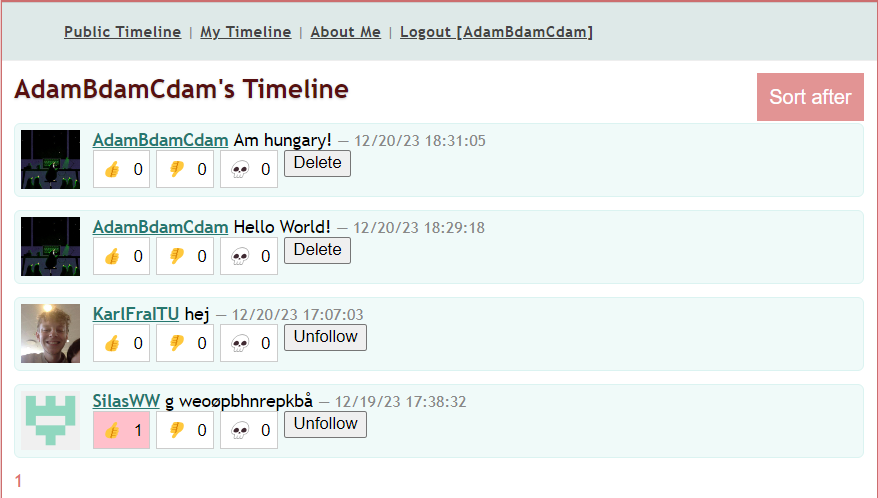

# Design and Architecture of _Chirp!_

## Domain model

Our domain model is built around the core concept of an Author, which is central to the _Chirp!_ application's functionality. An Author represents a user of the application, encapsulating their identity and interactions within the system. The UML class diagram model the key entities that make up our application.


### Author
The Author entity is an extension of the ASP.NET Identity's IdentityUser, inheriting features essential for authentication and authorization.

Each Author has a collection of Cheep entities, representing the messages, or posts, that the author creates within the application. This one-to-many relationship is depicted by a composition association, emphasizing that Cheeps are intrinsic to their Author and cannot exist independently.

In addition to creating cheeps, Authors can 'follow' other Authors. This is represented by a many-to-many self-referencing association, indicating that an Author can follow multiple other Authors and also be followed by multiple others. This relationship captures the essence of the application's social interaction capabilities.

### Cheep
A Cheep is essentially a message, or a singular piece of communication, created by an Author. Each Cheep is uniquely identified by a Guid and contains the message text along with a timestamp of its creation. Cheeps is in a one-to-many composition with Authors, meaning that, Authors can have many cheeps, but cheeps must have exactly one author. Additionally, they have a strong life-cycle dependency.

### Following
Chirp allows its users to follow and unfollow each other. The follow entity is used to enforce this functionality, by storing the id of the one who followed and the id of the one getting a follower. In the database, there is a table called Followers, where a new tuple is inserted. The tuple is made up with four columns, FollowerId, FollowedId, FollowerAuthorId and FollowedAthorId. The Followed being the one who followed another user, and the Follower being the one who got a new follower. The primary key are a unique combination of the FollowerId and FollowedId. This stops a user for following the same user multiple times, but let two users follow each other. Optimally, FollowerAuthorId and FollowedAuthorId could be deleted, because it tracks the same info. 

### Reactions
A reaction is the entity that refers to the interactive engagement that users can express in response to a cheep. These reactions are represented by a “thumps up” emoji that turns red if pressed. For each cheep a number of reactions will be displayed in the application. Each reaction is uniquely identified by a Guid representing the cheep, a string which represents the user who has reacted and a reactiontype representing which type of reaction it is. Reactions is in one-to-many relationships with both authors and cheeps meaning that both authors and cheeps can have many reactions but each reaction is uniquely related to one author and one cheep.

The reactions functionality is controlled by its interface IReactionRepository with it’s three mandatory methods, HasUserReacted, ReactionOnCheep and GetReactionAmount. 
ReactionOnCheep is an asynchronous task that takes a reactiontype, cheepid and username. The task starts by checking for the specific username and cheepId in the database and if any of those two are null the method returns an exception.

If not an instance of the object reaction will be created. Along side the task instantiate a variable “currentReaction” and check if the cheep already has a reaction from the user in the database. Based on the outcome of the check the system will either add the reaction to the database or remove it from database. This is because the ReactionOnCheep task handles both cases where a user wants to react on the cheep(add a reaction to the database) or remove the reactions from the cheep(remove the reaction in the database).

The asynchronous task “HasUserReacted” is responsible for letting the system know if a user has already reacted on a cheep. It takes a cheepId and username as arguments. Firstly it check whether or not a user is to be found in the database and if that is the case an exception is thrown. In the case where a user is found the task checks if the database contains a reaction sat on the cheep and if the user is the owner of that reactions. The result will be a boolean which is depended on the user interaction with the cheep.

The last task is responsible for letting the system know how many reactions a cheep has. This is simply done be checking the database how many reactions are related to the cheepId the task takes as argument. These get put in a list where it asynchronously returns the total number of reactions. 

## Architecture — In the small
Our application is separated into 3 main layers, that are common for the onion architecture

Layers:
* core
* infrastructure
* web

Dependencies:
* identity -> infrastructure
* ef core -> infrastructure
* core -> infrastructure
* OAuth -> web
* core -> web
* infrastructure -> web
* 


## Architecture of deployed application

## User activities

User Journey for Unauthenticated Users

The unauthenticated user is able to browse all cheeps on the public timeline. That is, they can only view them. Since they aren’t authenticated they have no personal timeline and no ‘About me’ page to visit. Besides viewing the public timeline they have the ability to log in. In the log in page they can be authenticated through github.


Image X, the public timeline for an unauthenticated user.

Image X shows the top of the webpage, that the unauthenticated user sees. Under the logo, the user is able to navigate the website by clicking on the links ‘Public Timeline’ and ‘Login’. The public timeline serves as the frontpage, so the ‘Public Timeline’ link is meant to return to the front page, when the user is somewhere else on the website.


Image XX, The bottom of the public timeline for the unauthenticated user


Image XX shows the bottom of the frontpage for the unauthenticated user. Here the user can use the numbers and arrows highlighted in the image, to scroll through the different pages of cheeps. There are a maximum of 32 cheeps per page. 

The user journey of the unauthenticated user is shown in a sequence diagram in figure X below.


Diagram X. Sequence diagram of the user journey of the unauthenticated user

As illustrated by the above diagram, the options of the unauthenticated user are very limited, as most of the functionalities of the applications are made specifically for authenticated users.


User Journey for Authenticated Users

Functionality of the authenticated user

Once the user is authenticated, a lot more functionalities become available compared to the unauthenticated user. These functionalities include the ability to post cheeps, delete cheeps, adding a reaction on other user’s posts, following other users, viewing ‘My timeline’, viewing other users’ timelines and deleting all personal information related to the user as well as deleting all cheeps posted by the user. All this functionality is visualized it the sitemap. 

Posting, reacting, following and deleting - A user story

The authenticated user is met with a front page that can be seen in image XX.


A typical use application like this, entails posting a cheep. This is done from the front page, just under the headline. The user will write a cheep in the input field, and press ‘enter’ or press the ‘Share’ button, to post it. 


After posting the cheep the user wants to react to another user’s cheep. This is done by pressing one of the react buttons, that can be seen on Image XX, on the cheep that is there. The user can either give a ‘thumbs up’, a ‘thumbs down’ or react with a skull. The user can only react in one way, meaning they can not leave both a ‘thumbs up’ and a ‘thumbs down’ on the same post. After reacting to a post the chosen reaction will be highlighted with the color pink, as shown in image XXX below.


After reacting to the cheep, the user now wants to follow the user that posted it. This is easily done by pressing the ‘Follow’ button, which is seen to the right of the reactions. After pressing the ‘Follow’ button it changes to ‘Unfollow’ as seen image XXXX below.


The final act of the user will be deleting the cheep they posting in the beginning. On cheeps posted by the user, a ‘delete’ button can be found where the ‘Follow’ button would be, if it was a cheep of another user. Clicking the ‘delete’ button result in the cheep being deleted.


‘My Timeline’, other user’s timeline and deleting profile - a user story

The user starts their journey by viewing ‘My Timeline’. The link to this page is found in the navigation bar. Here the user can see the cheeps they have posted, and the cheeps of the users they are following.



After viewing the ‘My Timeline’ page, the user wants to see the timeline of another user, so they click on the username of the user who’s timeline they want to view.


The final act of the user is to delete their profile. They do this by going to the ‘About Me’ page. This page is seen in image X.


On the ‘About Me’ page the user, can see information about themselves, as well as see the cheeps they have posted. A button with red text saying ‘Forget Me!’ can be seen below the cheeps. By pressing this button, all the user’s information will be deleted, and their cheeps as well. All reaction they have left on other users’ posts will be delete and their following of other users will also be deleted. Lastly the user will be unauthenticated and redirected to the ‘Public Timeline’.


## Sequence of functionality/calls trough _Chirp!_

# Process

## Build, test, release, and deployment
We use Github Actions to automate the build, test, release and deployment process of our executables and website. This pipeline is centered around two workflows, one for the executables, and one for the website.

### Publishing workflow


The publishing workflow focuses on creating executable artifacts for various platforms, including Linux, Windows, macOS, and macOS ARM. This workflow is triggered by pushing specific version tags, reflecting our versioning strategy. We apply the [semver](https://semver.org/) strategy. 

After the standard initial steps of checking out the repository and setting up the .NET Core environment, the workflow splits into parallel tasks for each platform. Each branch involves building the application, publishing the executable, zipping the file, and removing the build directory. This parallel structure allows for efficient and simultaneous preparation of executables for different platforms.

The final step is publishing the release on GitHub, attaching all the zipped executables. This process not only automates the release creation but also ensures that our application is readily available for a wide range of platforms, enhancing its accessibility to users.


### Deployment workflow


**Note:** Figure x, 'Activity Diagram Deployment' should have been here, but latex has its own life, and its not easy to fix when it needs to go through pandoc. 

Our deployment workflow, as visualized in the activity diagram, efficiently manages the deployment of the Chirp! application to Azure Web App. The process is triggered upon pushes to the main branch or via manual dispatch, ensuring that our latest stable build is always deployed.

The workflow begins with checking out the repository and setting up the .NET Core environment. The build phase involves compiling the code and publishing it to a specified directory. The published application is then uploaded as an artifact, ready for deployment.

In the deployment phase, the build artifact is downloaded and deployed to the Azure Web App. This automated process ensures a consistent and reliable deployment strategy, minimizing human error and streamlining our release process. 


## Team work

## How to make _Chirp!_ work locally

## How to run test suite locally

# Ethics
We are committed to being inclusive and respectful to anyone, related or unrelated to the work done in this project. We have included a slightly modified version of the Citizen Code of Conduct, that has been included in our repository on Github under [CODE_OF_CONDUCT](https://github.com/ITU-BDSA23-GROUP25/Chirp/blob/main/CODE_OF_CONDUCT.md).   

## License
We have picked the MIT License for our project. The MIT License is a simple and highly permissive open-source software license. It is one of the least restrictive, of the established licenses available. Under the MIT License, users are granted almost unrestricted freedom to use, modify, distribute, and sublicense the software. Our only requirement is that the copyright notice and license is included with the software when redistributed. As our group name is included in the MIT-license, this ensures that we are attributed. Additionally, the license absolves us of any responsibility or liability of how the software is used by others.

We have included the full text of the license below:

```text
MIT License

Copyright (c) 2023 ITU-BDSA23-GROUP25

Permission is hereby granted, free of charge, to any person obtaining a copy
of this software and associated documentation files (the "Software"), to deal
in the Software without restriction, including without limitation the rights
to use, copy, modify, merge, publish, distribute, sublicense, and/or sell
copies of the Software, and to permit persons to whom the Software is
furnished to do so, subject to the following conditions:

The above copyright notice and this permission notice shall be included in all
copies or substantial portions of the Software.

THE SOFTWARE IS PROVIDED "AS IS", WITHOUT WARRANTY OF ANY KIND, EXPRESS OR
IMPLIED, INCLUDING BUT NOT LIMITED TO THE WARRANTIES OF MERCHANTABILITY,
FITNESS FOR A PARTICULAR PURPOSE AND NONINFRINGEMENT. IN NO EVENT SHALL THE
AUTHORS OR COPYRIGHT HOLDERS BE LIABLE FOR ANY CLAIM, DAMAGES OR OTHER
LIABILITY, WHETHER IN AN ACTION OF CONTRACT, TORT OR OTHERWISE, ARISING FROM,
OUT OF OR IN CONNECTION WITH THE SOFTWARE OR THE USE OR OTHER DEALINGS IN THE
SOFTWARE.
```

The license can be found on our [Github repository](https://github.com/ITU-BDSA23-GROUP25/Chirp/blob/main/LICENSE), under LICENSE.

## LLMs, ChatGPT, CoPilot, and others
Lad os lige snakke om hvad vi siger her?

Lille test

<!-- Denne sektion er ikke en del af template -->
# Perspektivering, eller overvejelser, eller noter, eller fri leg?
Den her sektion er ikke en del af templatet, men jeg tænker her kan vi skrive nogle overvejelser som vi har gjort og som vi måske/måske ikke vil have med i rapporten.

**Overvejelse:** Bør followers i class diagrammet være en association class?
